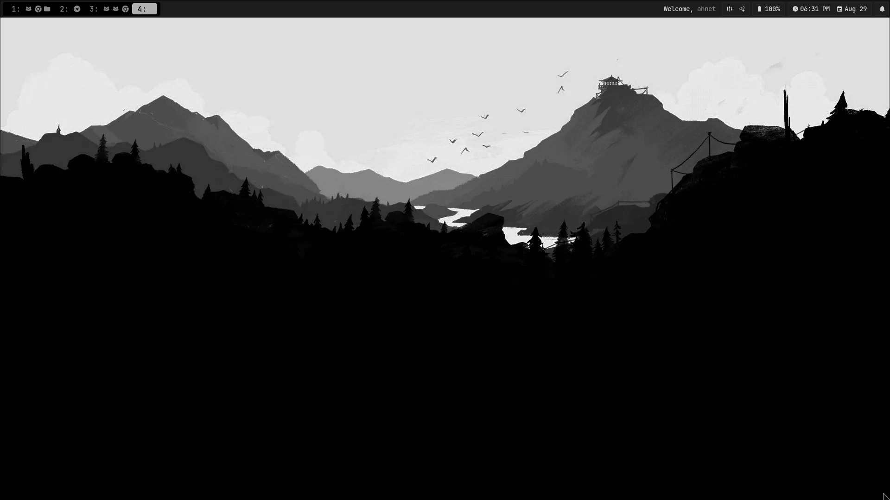
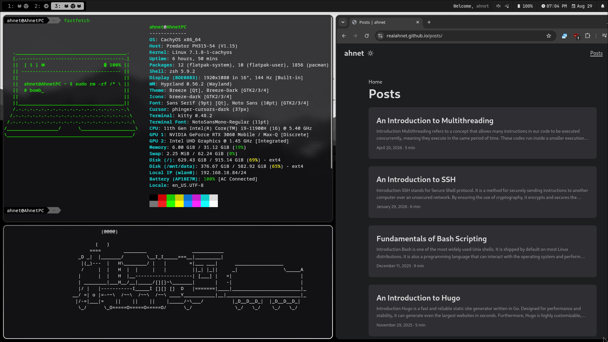

# Minimal Monochrome Rice for Hyprland







This rice is nothing special. Just a minimal monochrome themed rice that I am still change as I need to. This rice is my first ever attempt at hyprland and I am pretty happy with how it turned out.

> This rice was inspired by following **[josean-dev](https://github.com/josean-dev)**'s **[YouTube tutorial](https://www.youtube.com/watch?v=PEgDssV0nW0)**.

---


This guide details how to install and configure this Hyprland dotfiles setup on your system.

> [!WARNING]
> **Backup Warning:** Make sure to backup your current configurations (`~/.config/hypr`, `~/.config/waybar`, etc.) before running the installation script to avoid overwriting your personal settings.

---

## 1. Distribution Support

* This installer script and guide are written specifically for **Arch Linux** (and Arch-based distributions like CachyOS or EndeavourOS).
* If you are running a different distribution (Fedora, Debian, Ubuntu, Void, etc.), inspect the included `pkglist.txt` to find and install the equivalent packages for your distribution's package manager.

---

## 2. Installation Instructions

Clone the repository and run the installation script:

```bash
git clone https://github.com/your-username/hyprland-dots.git
cd hyprland-dots
chmod +x install.sh
./install.sh
```

> [!WARNING]
> The install script symlinks the directories. Deleting the repository after running the install script will nullify this rice.
> Hence, either keep this repository cloned or copy the respective contents to their relevant folders manually for permanent effect.

---

## 3. Predator Laptop Setup & RGB Customization
Since I have a Predator Helios 300 (PH315-54-91Y3), I've made scripts for my Keyboard's RGB adjustment. If you are running this configuration on an Acer Predator laptop, take note of the hardware-specific scripts:

1. **Kernel Module Dependency:**
   To control the turbo fan button and RGB keyboard zones on Acer Predator hardware, install the required Linux kernel module:
   * Repository: [acer-predator-turbo-and-rgb-keyboard-linux-module](https://github.com/JafarAkhondali/acer-predator-turbo-and-rgb-keyboard-linux-module)

2. **Customizing RGB Startup & Power Scripts:**
   * **Startup Command:** Modify the RGB startup execution command inside `~/.config/hypr/hyprland.lua` to fit your desired default lighting effects and colors.
   * **Power Listener Script:** Check `~/.config/hypr/scripts/hypr_power_listener.sh`. It is configured with custom RGB hex values for AC power mode and, configured to turn RGB off on battery power mode. Adjust these color values to match your personal preference.

---

## 4. Mute LED Functionality

I've included a script for mute led functionality for my helios 300 model. It was reverse engineered from windows via realtek's antique codec dump software. It may not work on newer models or may be different. In that case you can do something similiar by following this guide for asus laptops: **[here](https://asus-linux.org/blog/sound-2021-01-11/)**.

> Thanks to **[meowdroider](https://github.com/meowdroider)** for helping me out with this.
> It also needs a firmware patch as the guide linked has specified.

---

## 5. Keybinds
Make sure to read the keybind section in hyprland.lua for all the relevant keybinds. However, here are the most commonly used ones:

> I've set `Alt` to be my `SUPER` since it is easier for my fingers to reach them. You can change this in the hyprland.lua config.
> You can add your own keybinds or modify them as you need.

| Keybinding | Action & Description |
| :--- | :--- |
| `Alt + T` | Opens default terminal (`kitty`) |
| `Alt + F` | Opens default file manager (`nemo`) |
| `Alt + B` | Opens browser (`google-chrome-stable`) |
| `Alt + M` | Locks the screen (`hyprlock`) |
| `Alt + Shift + S` | Captures region screenshot (`hyprshot`) |
| `Alt + Space` | Opens application launcher (`rofi`) |
| `Alt + .` | Opens emoji picker (`rofi`) |
| `Alt + Shift + Space` | Opens command runner (`rofi`) |
| `Alt + Tab` | Cycles to the next open window |
| `Alt + Shift + Tab` | Cycles to the previous open window |
| `Alt + Q` | Closes the focused window |
| `Alt + Shift + Q` | Exits Hyprland / shuts down session |
| `Alt + P` | Opens display layout tool (`nwg-displays`) |
| `Alt + Shift + T` | Toggles window floating mode |
| `Alt + Shift + F` | Toggles window maximized fullscreen |
| `Alt + H / J / K / L` | Focuses adjacent window (Left / Up / Down / Right) |
| `Alt + Shift + H / J / K / L` | Moves focused window position (Left / Up / Down / Right) |
| `Alt + [0-9]` | Switches active workspace |
| `Alt + Shift + [0-9]` | Moves active window to workspace |
| `Alt + Mouse Scroll` | Scrolls workspace forward / backward |
| `Alt + Left Click + Drag` | Moves window |
| `Alt + Right Click + Drag` | Resizes window |

---

Make sure to open a PR if you have any suggestions or improvements to my configuration!

Thank you! 👋
